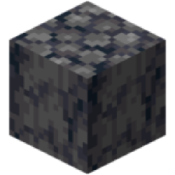

# [<](../README.md) Basalt Blocks

More Basalt

## Addon Data

| Key                | Value    |
|--------------------|----------|
| supported          | `yes` |
| namespace          | `basaltblocks` |
| version            | `1.3.0 ` |
| resource UUID            | `2660f6c8-4130-4745-a6f9-75366d9c1c11` |
| behavior UUID            | `d627db6d-5e48-425f-88d5-40f0ff30427f` |
| mc_version         | `1.19.80`   |
| multiplayer_tested | `no`     |
| has_config         | `no`     |
| dependency         | `null`   |

## LINKS
- [Download](https://mcpedl.com/basalt-blocks-addon/)
- [Wiki Page](https://github.com/legopitstop/addons/wiki/Basalt_Blocks)
- [License](https://legopitstop.weebly.com/license.html)
- [Bug Report](https://github.com/legopitstop/addons/issues)