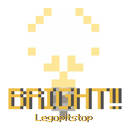

# [<](../README.md) Bright

The only light add-on you will ever need!

## Addon Data

| Key                | Value    |
|--------------------|----------|
| supported          | `yes` |
| namespace          | `bright` |
| version            | `1.1.0 ` |
| resource UUID            | `a9667f51-351b-47b6-bf2b-cedaa45cd884` |
| behavior UUID            | `2fe12920-6843-4f14-aa89-c4c1e14f4b9f` |
| mc_version         | `?` |
| multiplayer_tested | `no`     |
| has_config         | `no`     |
| dependency         | `Assets Plus v1.2.0`   |

## LINKS
- [Download](https://mcpedl.com/bright-addon-1/)
- [Wiki Page](https://github.com/legopitstop/addons/wiki/Bright)
- [License](https://legopitstop.weebly.com/license.html)
- [Bug Report](https://github.com/legopitstop/addons/issues)