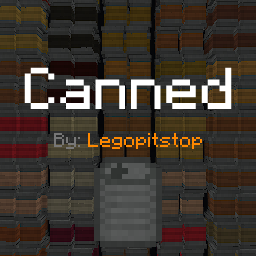

# [<](../README.md) Canned

Canned goods?

## Addon Data

| Key                | Value    |
|--------------------|----------|
| supported          | `yes` |
| namespace          | `canned` |
| version            | `1.1.0 ` |
| resource UUID            | `7bcddacb-acea-4d89-a348-c5c358b0c143` |
| behavior UUID            | `7f7c8a3b-ca5a-41c5-885f-24ce7c6219ab` |
| mc_version         | `1.19.80` |
| multiplayer_tested | `no`     |
| has_config         | `no`     |
| dependency         | `null`   |

## LINKS
- [Download](https://mcpedl.com/canned-addon/)
- [Wiki Page](https://github.com/legopitstop/addons/wiki/Canned)
- [License](https://legopitstop.weebly.com/license.html)
- [Bug Report](https://github.com/legopitstop/addons/issues)