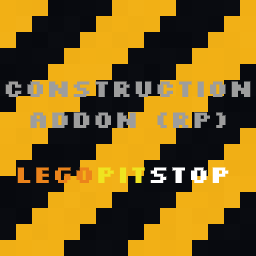

# [<](../README.md) Construction Blocks

Get Your Built On!

## Addon Data

| Key                | Value    |
|--------------------|----------|
| supported          | `yes` |
| namespace          | `const` |
| version            | `1.8.0 ` |
| resource UUID            | `14b9a43a-8846-42e5-9eb5-d547510a60c7` |
| behavior UUID            | `654051c3-adf1-439c-87ee-6c92a1fbcec9` |
| mc_version         | `?` |
| multiplayer_tested | `no`     |
| has_config         | `no`     |
| dependency         | `null`   |

## LINKS
- [Download](https://mcpedl.com/construction-addon/)
- [Wiki Page](https://github.com/legopitstop/addons/wiki/Construction_Blocks)
- [License](https://legopitstop.weebly.com/license.html)
- [Bug Report](https://github.com/legopitstop/addons/issues)