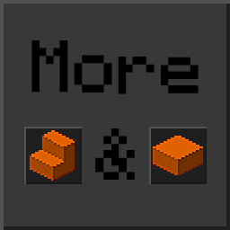

# [<](../README.md) More Stairs and Slabs

More Stairs and Slabs!

## Addon Data

| Key                | Value    |
|--------------------|----------|
| supported          | `yes` |
| namespace          | `more_ss` |
| version            | `1.4.0 ` |
| resource UUID            | `f27ad127-cb0a-4185-96c3-483e1ba7142b` |
| behavior UUID            | `bfd091d1-2d3a-4e42-8856-cb546696262e` |
| mc_version         | `1.17.30` |
| multiplayer_tested | `no`     |
| has_config         | `no`     |
| dependency         | `null`   |

## LINKS
- [Download](https://mcpedl.com/more-stairs-and-slabs-addon/)
- [Wiki Page](https://github.com/legopitstop/addons/wiki/More_Stairs_and_Slabs)
- [License](https://legopitstop.weebly.com/license.html)
- [Bug Report](https://github.com/legopitstop/addons/issues)