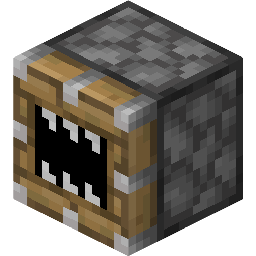

# [<](../README.md) Ultimate Block Breaker

Block breaker!

## Addon Data

| Key                | Value    |
|--------------------|----------|
| supported          | `yes` |
| namespace          | `breaker` |
| version            | `1.2.0 ` |
| resource UUID            | `fab6b726-c1f9-4fff-889b-27010898272a` |
| behavior UUID            | `7fda5795-39b2-40bb-8996-e20901af09ca` |
| mc_version         | `?` |
| multiplayer_tested | `no`     |
| has_config         | `no`     |
| dependency         | `null`   |

## LINKS
- [Download](https://mcpedl.com/ultimate-block-breaker-addon/)
- [Wiki Page](https://github.com/legopitstop/addons/wiki/Ultimate_Block_Breaker)
- [License](https://legopitstop.weebly.com/license.html)
- [Bug Report](https://github.com/legopitstop/addons/issues)