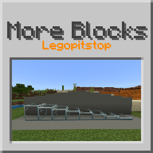

# [<](../README.md) More Blocks

Lot's More Blocks!

## Addon Data

| Key                | Value    |
|--------------------|----------|
| supported          | `yes` |
| namespace          | `moreblocks` |
| version            | `1.3.0 ` |
| resource UUID            | `4791d53e-88de-49f6-846b-a2cbe7508032` |
| behavior UUID            | `bf24499d-0163-4ccb-a485-2c091c51317b` |
| mc_version         | `1.19.80` |
| multiplayer_tested | `no`     |
| has_config         | `no`     |
| dependency         | `Assets Plus v1.4.0`   |

## LINKS
- [Download](https://mcpedl.com/more-blocks-add-on/)
- [Wiki Page](https://github.com/legopitstop/addons/wiki/More_Blocks)
- [License](https://license.lpsmods.dev)
- [Bug Report](https://github.com/legopitstop/addons/issues)